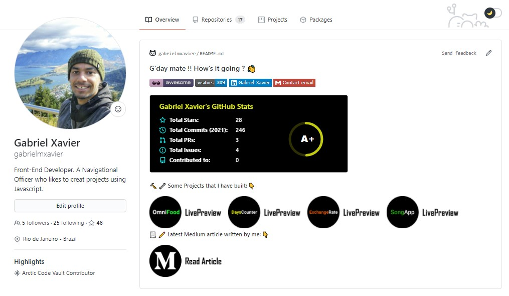

# Awesome Developer Profile

     

Curated list of Developer Github Profiles for your inspiration.

Follow this guide: [GitHub new feature to add README on your Profile ](https://dev.to/coderjojo/github-new-feature-to-add-readme-on-your-profile-ggc)

Contribute to this repository by opening a [PR](./CONTRIBUTING.md) to this repository. Refer to the [CONTRIBUTING](./CONTRIBUTING.md) file for direction.

This repository was inspired from [Developer Portfolios](https://github.com/emmabostian/developer-portfolios) github repository.

Make your Profile look good & Inspire other's. Don't forget to leave :star: if you found this helpful.

**Jump to:**  | [A](#a) | [B](#b) | [C](#c) | [D](#d) | [E](#e) | [F](#f) | [G](#g) | [H](#h) | [I](#i) | [J](#j) | [K](#k) | [L](#l) | [M](#m) | [N](#n) | [O](#o) | [P](#p) | [R](#r) | [S](#s) | [T](#t) | [U](#u) | [V](#v) | [W](#w) | [Y](#y) | [Z](#z)

---

## A

- [Aakarsh B](https://github.com/Aakarsh-B)
  

    
Preview

    
  

- [Aakash Sinha](https://github.com/isupersky)
  

    
Preview

    
  

- [Abhinandan Trilokia](https://github.com/Trilokia)
  

    
Preview

    
  

- [Abhinav Sharma](https://github.com/ABSphreak)
  

    
Preview

    
  

- [Abhishek Singh Dhadwal](https://github.com/AbhishekSinghDhadwal)
  

    
Preview

    
  

- [Abhishek Sisodiya](https://github.com/sisodiya2421)
  

    
Preview

    
  

- [acervenky](https://github.com/acervenky)
  

    
Preview

    
  

- [Adam Alston](https://github.com/adamalston)
  

    
Preview

    
  

- [Adnan Azmee](https://github.com/adnanazmee)
  

    
Preview

    
  

- [Adrian Sudbury](https://github.com/asudbury)
  

    
Preview

    
  

- [Aditya Vikram Singh](https://github.com/AVS1508)
  

    
Preview

    
  

- [aeris](https://github.com/aeristhy)
  

    
Preview

    
  

- [afc163](https://github.com/afc163)
  

    
Preview

    
  

- [Ahsan Khan](https://github.com/ahsankhan26)
  

    
Preview

    
  
  
- [Akas Rai](https://github.com/akasrai)
  

    
Preview

    
  

- [Akash Patel](https://github.com/imakash3011)
  

    
Preview

    
  

- [Amado Abaca](https://github.com/amadoabaca)
  

    
Preview

    
  

- [Alessandra Bilardi](https://github.com/bilardi)
  

    
Preview

    
  

- [Alfred Dagenais](https://github.com/alfreddagenais)
  

    
Preview

    
  

- [Aman Ansari](https://github.com/aman-atg)
  

    
Preview

    
  

- [Aman Anku](https://github.com/amananku26)
  

    
Preview

    
  

- [Aman Kumar Dewangan](https://github.com/amandewatnitrr)
  

    
Preview

    
  

- [Ana Caroline Sanchez Silva](https://github.com/anacaroliness9)
  

    
Preview

    
  

- [Anh-Thi DINH](https://github.com/dinhanhthi)
  

    
Preview

    
  

- [Anirudh Belwadi](https://github.com/anirudhbelwadi)
  

    
Preview

    
  

- [AnOrdinaryUsername](https://github.com/AnOrdinaryUsername)
  

    
Preview

    
  

- [Anurag Hazra](https://github.com/anuraghazra)
  

    
Preview

    
  

- [Anushka Verma](https://github.com/verma-anushka)
  

    
Preview

    
  

- [Ari](https://github.com/ari-hacks)
  

    
Preview

    
  

- [Arturs Smirnovs](https://github.com/arturssmirnovs)
  

    
Preview

    
  

- [Arunsridher Ambati](https://github.com/arunsridher)
  

    
Preview

    
  

- [Asmit Malakannawar](https://github.com/Asmit2952)
  

    
Preview

    
  

- [Avinal Kumar](https://github.com/avinal)
  

    
Preview

    
  

## B

- [Bayrem Gharsellaoui](https://github.com/kaizoku-oh)
  

    
Preview

    
  

- [Bardiesel](https://github.com/bardiesel)
  

    
Preview

    
  

- Bereket Semagn (profile deleted or username changed)
  

    
Preview

    
  

- Bilgehan Gecici (profile deleted or username changed)
  

    
Preview

    
  

- [Bloedboemmel](https://github.com/bloedboemmel)
  

    
Preview

    
  

- [Braydon Wang](https://github.com/braydonwang)
  

    
Preview

    
  
  
- [breakdowns](https://github.com/breakdowns)
  

    
Preview

    
  
  
- [Brian Douglas](https://github.com/bdougie)
  

    
Preview

    
  

- [Bugahontas](https://github.com/bugahontas)
  

    
Preview

    
  

## C

- [Cameron Thompson](https://github.com/cdthomp1)
  

    
Preview

    
  

- [Camila L. Oliveira](https://github.com/clcmo)
  

    
Preview

    
  

- [Candida Noronha](https://github.com/Candida18)
  

    
Preview

    
  

- [Carlos Ubaldo](https://github.com/accomigt)
  

    
Preview

    
  

- [Caroline Heloíse](https://github.com/Carol42)
  

    
Preview

    
  

- [Chiraag Kakar](https://github.com/chiraag-kakar)
  

    
Preview

    
  

- [Claudio Wunder](https://github.com/ovflowd)
  

    
Preview

    
  

- [Chege Bryan](https://github.com/ChegeBryan)
  

    
Preview

    
  

- [Clark](https://github.com/ms314006)
  

    
Preview

    
  

- [chinmay29hub](https://github.com/chinmay29hub)
  

    
Preview

    
  

## D

- [dahhd](https://github.com/dahhd)
    

      
Preview

      
    

- [Daniel Caballero](https://github.com/danielcaballero796)
  

    
Preview

    
  

- [Daniel Moya](https://github.com/dmoyadev)
  

    
Preview

    
  

- [Danilo Barreto](https://github.com/danilobbezerra)
  

    
Preview

    
  

  
 - [Dario De Nardi](https://github.com/dariodenardi)
   

     
Preview

     
   

  
- [Darshan R](https://github.com/darshanr27)
  

    
Preview

    
  

- [DavidsDvm](https://github.com/DavidsDvm)
  

    
Preview

    
  

- [Dedar Alam](https://github.com/devded)
    

      
Preview

      
    

- [deep5050](https://github.com/deep5050)
  

  
Preview

  
    

- [DeepaPrasanna](https://github.com/DeepaPrasanna)
  

  
Preview

  
    

- [deetoo](https://github.com/deetoo)
  

  
Preview

  
    

- [DenverCoder1](https://github.com/DenverCoder1)
  

  
Preview

  
    

- [Devesh Kumar Singh](https://github.com/Devesh-19)
  

    
Preview

    
  

- [Dhruv Mehta](https://github.com/Dhruv-194)
  

   
Preview

   
  

- [Dineshkarthik](https://github.com/Dineshkarthik)
    

      
Preview

      
    

- [Dipanjan De](https://github.com/bacon-delight)
    

      
Preview

      
    

- [Douglas Ferreira](https://github.com/DouglasDRF)
    

      
Preview

      
    

- [Dustin Kelly](https://github.com/dustin100)
   

     
Preview

     
  

## E

- [Eana Hufwe](https://github.com/blueset)
  

    
Preview

    
  

- [Emerson Thompson](https://github.com/thompsonemerson)
  

    
Preview

    
  

- [Evaristo Cuesta](https://github.com/evaristocuesta)
  

    
Preview

    
  

- [Esrat Maria](https://github.com/EsratMaria)
  

    
Preview

    
  

## F

- [fadyehabamer](https://github.com/fadyehabamer)
  

    
Preview

    
  

- [furkan-gulsen](https://github.com/Furkan-Gulsen)
  

    
Preview

    
  

## G

- [Gabriel Xavier](https://github.com/gabrielmxavier)
  

    
Preview

    
  

- [Gustavo Soriano](https://github.com/gustavosoriano)
  

    
Preview

    
  

## H

- [Halfrost](https://github.com/halfrost)
  

    
Preview

    
  

- [hashfx](https://github.com/hashfx)
  

    
Preview

    
  

- [Hemaraj Dhakal](https://github.com/Hemraj183)
  

    
Preview

    
  

- [Heguke](https://github.com/heguke)
  

    
Preview

    
  

- [Hanshul Chandel](https://github.com/hanshulll)
  

   
Preview

   
   

## I

- [Ian Sebastian Mathew](https://github.com/iansmathew)
  

    
Preview

    
  

- [Ibrahim Olayinka](https://github.com/IbrahimOlayinka)
  

    
Preview

    
  

- [Israel Laguan](https://github.com/Israel-Laguan/Israel-Laguan)
  

    
Preview

    
  

- [Ishika Kesarwani](https://github.com/ishikkkkaaaa)
  

    
Preview

    
  

- [Ish Kapoor](https://github.com/ishkapoor2000)
  

    
Preview

    
  

- [Ivan](https://github.com/imickovski)
  

    
Preview

    
  

- [Ivelin](https://github.com/Iwi4a)
  

    
Preview

    
  

- [Isha2103](https://github.com/Isha2103)
  

    
Preview

    
  

## J

- [Jacques Blom](https://github.com/jacques-blom)
  

    
Preview

    
  

- [Jason Lengstorf](https://github.com/jlengstorf)
  

    
Preview

    
  

- [Jatin Yadav](https://github.com/jatiinyadav)
  

    
Preview

    
  

- [Jaye Hernandez](https://github.com/jayehernandez)
  

    
Preview

    
  

- [Jean Jacques Barros](https://github.com/jjeanjacques10)
  

    
Preview

    
  

- [Jessica Lim](https://github.com/jessicalim8)
  

    
Preview

    
  

- [Jishan Shaikh](https://github.com/jishanshaikh4)
   

     
Preview

     
   

- [Joykishan Sharma](https://github.com/JoykishanSharma)
  

    
Preview

    
  

- [JayB Kim](https://github.com/kogisin)
  

    
Preview

    
  

## K

- [Karina Chichifoi](https://github.com/TryKatChup)
  

    
Preview

    
  

- [Karras](https://github.com/karras)
  

    
Preview

    
  

- [Karthik Nayak](https://github.com/KarthikNayak024)
  

    
Preview

    
  

- [KasRoudra](https://github.com/KasRoudra)
  

    
Preview

    
  

- [Knightbearr](https://github.com/knightbearr)
  

    
Preview

    
  

  
- [Kiran Babu Muddam](https://github.com/kiranmuddam)
  

    
Preview

    
  

- [Kwangsing3](https://github.com/kwangsing3)
  

    
Preview

    
  

## L

- [L0um15](https://github.com/L0um15)
  

    
Preview

    
  

- [LachlanDev](https://github.com/LachlanDev)
  

    
Preview

    
  

- [Leandro Simões](https://github.com/leandrosimoes)
  

    
Preview

    
  

- [Loftwah](https://github.com/loftwah)
  

    
Preview

    
  

- [Luca Fluri](https://github.com/lucafluri)
  

    
Preview

    
  

- [Lucas Henrique](https://github.com/LucasHenrique-dev)
  

    
Preview

    
  

- [Luis Silva](https://github.com/luis-gustavoj)
  

    
Preview

    
  

- [Lukas-Batema](https://github.com/Lukas-Batema/Lukas-Batema)
  

    
Preview

    
  

- [Lunar Lynix](https://github.com/lunarlynix)
  

    
Preview

    
  

## M

- [Mahendra](https://github.com/hendrasob)
  

    
Preview

    
  

- [Manigandan Dharmalingam](https://github.com/manigandand)
  

    
Preview

    
  

- [Manoj Boddu](https://github.com/manumanoj0010)
  

    
Preview

    
  

- [Mark Jesper Pillerva](https://github.com/mark123jesper)
  

    
Preview

    
  

- [Matteas Eden](https://github.com/Matteas-Eden)
  

    
Preview

    
  

- [Maya Gershovitz Bar](https://github.com/mgershovitz)
  

    
Preview

    
  

- [Michele Righi](https://github.com/mikyll)
  

    
Preview

    
  

- [Mikhail Chigrin](https://github.com/frozrt)
  

    
Preview

    
  

- [Mit Patel](https://github.com/mitp7)
  

    
Preview

    
  

- [Mpho Mphego](https://github.com/mmphego)
  

    
Preview

    
  

- [Md Farhaan](https://github.com/mdfarhaan)
  

    
Preview

    
  

- [Monica Powell](https://github.com/M0nica)
  

    
Preview

    
  

- [Moshfiqur Rahman Rony](https://github.com/moshfiqrony)
  

    
Preview

    
  

- [Mridul Panda](https://github.com/Mridul2820)
  

      
Preview

      
  

- [Muhammad Sameer Farooq](https://github.com/msameerfarooq)
  

    
Preview

    
  

- [Mukul Sharma](https://github.com/mukul98s)
  

    
Preview

    
  

- [Murshid Azher](https://github.com/murshidazher)
  

    
Preview

    
  

  
- [Murari Sabavath](https://github.com/murarisabavath)
  

    
Preview

    
  

## N

- [Kunware Nakul Singh Bhati](https://github.com/nakulbhati)
  

    
Preview

    
  

- [Naina Upadhyay](https://github.com/naina25)
  

    
Preview

    
  

- [Naman Parashar](https://github.com/nparashar150)
  

    
Preview

    
  

- [Nathan Araújo](https://github.com/ntaraujo)
  

    
Preview

    
  

- [Nelson Alba Jr. 許鑫偉 (nelly)](https://github.com/nellyXinwei)
  

    
Preview

    
  

- [Nikunj Sharma](https://github.com/nouveau-riche)
  

    
Preview

    
  

- [Nikita Jain ](https://github.com/nikita1610)
  

    
Preview

    
  

- [Nilutpol Kashyap](https://github.com/nilutpolkashyap)
  

    
Preview

    
  

- [Nitish Bhatt](https://github.com/initishbhatt)
  

    
Preview

    
  

- [nixdonut](https://github.com/nixdonut)
  

    
Preview

    
  

## O

- [Ojaswi Awasthi](https://github.com/Ojaswi2000)
  

    
Preview

    
  

- [Oktay Kır](https://github.com/OKTAYKIR)
  

    
Preview

    
  

- [OOQQ](https://github.com/OOQQ)
  

    
Preview

    
  

- [Oscar](https://github.com/blue-1ms)
  

    
Preview

    
  

## P

- [Pato Montecchiarini](https://github.com/pmontecchiarini)
  

    
Preview

    
  

- [Patrick Guo](https://github.com/shpatrickguo)
  

    
Preview

    
  

- [Pavel Rahman](https://github.com/pavstar619)
  

    
Preview

    
  

- [Peter Han](https://github.com/peterthehan)
  

    
Preview

    
  

- [Phanison](https://github.com/phanison898)
  

    
Preview

    
  

- [Piyush Suthar](https://github.com/piyushsuthar)
  

    
Preview

    
  

- [Platane](https://github.com/platane)
  

    
Preview

    
  

- [Pouya Saadeghi](https://github.com/saadeghi)
  

    
Preview

    

  Don't try to play it here!
  

- [Praneeth Reddy](https://github.com/Praneeth-rdy)
  

    
Preview

    
  

- [Pranjal Gupta](https://github.com/pranjal36)
  

      
Preview

      
  

- [Pratik Kumar](https://github.com/pr2tik1)
  

      
Preview

      
  

- [Prasad Narkhede](https://github.com/p014ri5)
  

    
Preview

    
  

## R
- [Rahul Dhanola](https://github.com/DHANOLA)
  

    
Preview

    
  

- [Racheli ver](https://github.com/racheliver)
  

    
Preview

    
  

- [Rachitt Shah](https://github.com/godslayer201)
  

    
Preview

    
  

- [Radha](https://github.com/RK1905101)
  

    
Preview

    
  

- [Ram Prakash](https://github.com/thedoodler)
  

    
Preview

    
  

- [Ramesh chandra](https://github.com/Rameshchandrapola)
  

    
Preview

    
  

- [Raushan Kumar](https://github.com/raushan606)
  

    
Preview

    
  

- [Rafael Freitas](https://github.com/RafaelOFreitas)
  

    
Preview

    
  

- [Ray Arayilakath](https://github.com/RayhanADev)
  

    
Preview

    
  

- [Rishika Ghosh](https://github.com/RishikaGhosh)
  

    
Preview

    
  

- [Rohit Kumar Saini](https://github.com/rockingrohit9639)
  

    
Preview

    
  

- [Ronan D'Souza](https://github.com/ronan696)
  

    
Preview

    
  

- [Rounak Neogy](https://github.com/RounakNeogy)
  

    
Preview

    
  

- [Rudik Rompich](https://github.com/rudikschess)
  

    
Preview

    
  

- [Rudraksh Kanekar](https://github.com/RudrakshK)
  

    
Preview

    
  

## S

- [Sabbir Mollah](https://github.com/SabbirMollah)
  

    
Preview

    
  

- [Sagar Sharma](https://github.com/Sagar-Sharma-7)
  

    
Preview

    
  

- [Sarfaraz Ahmad](https://github.com/GoogolDKhan)
  

    
Preview

    
  

- [Sarthak Mittal](https://github.com/mostlypanda)
  

    
Preview

    
  

- [Saurabh Kumar](https://github.com/Saurabh2509)
  

      
Preview

      
  

- [Saurav Chamoli](https://github.com/sauravchamoli17)
  

    
Preview

    
  

- [Shaan Khan](https://github.com/ShaanCoding)
  

    
Preview

    
  

- [Shawn Pereira](https://github.com/recurshawn)
  

   
Preview

   
  

- [Shree Vatsa N](https://github.com/vatsa287)
  

   
Preview

   
  

- [Siddharth Chandra](https://github.com/siddharth2016)
  

   
Preview

   
  

- [Shiryel](https://github.com/shiryel)
  

   
Preview

   
  

- [Shivashish](https://github.com/shivashishy)
  

   
Preview

   
  

- [Simon Willison](https://github.com/simonw)
  

    
Preview

    
  

- [Sindre Sorhus](https://github.com/sindresorhus)
  

    
Preview

    

  Yes, it's a GIF of a Loading Octocat!
  

- [Sneha Kumari](https://github.com/Snehakri022)
   

    
Preview

    
  

- [Soha Hussain](https://github.com/SohaHussain)
   

     
Preview

     
   

- [Somnath Paul](https://github.com/SP-XD)
   

     
Preview

     
   

   
   
- [SparkScratch-P (Prodyumna Pal) ](https://github.com/SparkScratch-P)
   

     
Preview

     
   

- [Srihari Kapu](https://github.com/sriharikapu)
  

    
Preview

    
  

- [Stanley Lim](https://github.com/Spiderpig86)
  

    
Preview

    
  

- [Sudip Mondal](https://github.com/sudip-mondal-2002)
  

    
Preview

    
  

- [Sudipto Ghosh](https://github.com/pydevsg)
  

    
Preview

    
  

- [Sukru Uzel](https://github.com/suzel)
  

    
Preview

    
  

- [Suman Chandra](https://github.com/ajay02111)
  

    
Preview

    
  

- [Sumanth Talluri](https://github.com/Sumanth-Talluri)
  

    
Preview

    
  

- [SynthesisDu](https://github.com/SynthesisDu)
  

      
Preview

      
  

  
- [System-Glitch](https://github.com/System-Glitch)
  

      
Preview

      
  

## T

- [Thales Brederodes](https://github.com/ThalesBMC)
  

    
Preview

    
  

- [Thaiane Braga](https://github.com/Thaiane)
  

    
Preview

    
  

- [Thiago Souza](https://github.com/thiagodesouza)
  

    
Preview

    
  

- [Tien Huynh TN](https://github.com/tienhuynh-tn)
  

    
Preview

    

- [Tim Burgan](https://github.com/timburgan)
  

    
Preview

    

  Too large to fit, too fun to not play!
  

  
- [Tim James](https://github.com/Tim-W-James)
  

    
Preview

    
  

## U

- [Uannabi](https://github.com/uannabi)
  

    
Preview

    
  Too large to fit, too fun to not play!
  

- [Udbhav Gambhir](https://github.com/ngudbhav)
  

    
Preview

    
  

## V

- [Vatana Chhorn](https://github.com/VatanaChhorn)
  

    
Preview

    
  

- [Vedant Jajoo](https://github.com/coderjojo)
  

    
Preview

    
  

- [Vimal Kumar](https://github.com/vimalverma558)
  

    
Preview

    
  

- [Vishwasa Navada K](https://github.com/vishwasnavadak)
  

    
Preview

    
  

## W

- [Waren Gonzaga](https://github.com/WarenGonzaga)
  

    
Preview

    
  

- [Waylon Walker](https://github.com/WaylonWalker)
  

    
Preview

    
  

- [Willnaoosmith](https://github.com/willnaoosmith)
  

    
Preview

    
  

## Y

- [Yashita Namdeo](https://github.com/yashitanamdeo)
  

    
Preview

    
  

- [yashsehgal](https://github.com/yashsehgal)
  

    
Preview

    
  

- [Yauhen Kavalchuk](https://github.com/yauhenkavalchuk)
  

    
Preview

    
  
  

## Z

- [zmcx16](https://github.com/zmcx16)
  

    
Preview

    
  

- [ZamranxD](https://github.com/ZamranxD)
  

    
Preview

    
  

