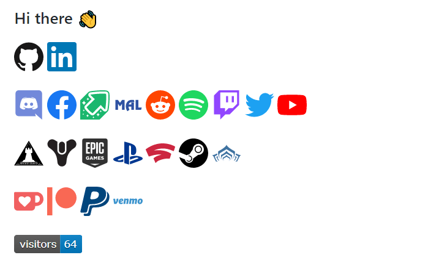

# Awesome Developer Profile

     

Curated list of Developer Github Profiles for your inspiration.

Follow this guide: [GitHub new feature to add README on your Profile ](https://dev.to/coderjojo/github-new-feature-to-add-readme-on-your-profile-ggc)

Contribute to this repository by opening a [PR](./CONTRIBUTING.md) to this repository. Refer to the [CONTRIBUTING](./CONTRIBUTING.md) file for direction.

This repository was inspired from [Developer Portfolios](https://github.com/emmabostian/developer-portfolios) github repository.

Make your Profile look good & Inspire other's. Don't forget to leave :star: if you found this helpful.

---

## A

- [Abhinav Sharma](https://github.com/ABSphreak)
  

    
Preview

    
  

- [acervenky](https://github.com/acervenky)
  

    
Preview

    
  

- [Adam Alston](https://github.com/adamalston)
  

    
Preview

    
  

- [Adrian Sudbury](https://github.com/asudbury)
  

    
Preview

    
  

- [Aditya Vikram Singh](https://github.com/AVS1508)
  

    
Preview

    
  

- [afc163](https://github.com/afc163)
  

    
Preview

    
  

- [Ahsan Khan](https://github.com/ahsankhan26)
  

    
Preview

    
  

- [Akas Rai](https://github.com/akasrai)
  

    
Preview

    
  

- [Alfred Dagenais](https://github.com/alfreddagenais)
  

    
Preview

    
  

- [Aman Ansari](https://github.com/aman-atg)
  

    
Preview

    
  

- [Anurag Hazra](https://github.com/anuraghazra)
  

    
Preview

    
  

- [Anushka Verma](https://github.com/verma-anushka)
  

    
Preview

    
  

- [Ari](https://github.com/ari-hacks)
  

    
Preview

    
  

- [Arturs Smirnovs](https://github.com/arturssmirnovs)
  

    
Preview

    
  

## B

- [Bayrem Gharsellaoui](https://github.com/kaizoku-oh)
  

    
Preview

    
  

- [Bereket Semagn](https://github.com/bereketsemagn)
  

    
Preview

    
  

- [Bilgehan Gecici](https://github.com/Bgstatic)
  

    
Preview

    
  

- [Brian Douglas](https://github.com/bdougie)
  

    
Preview

    
  

## C

- [Cameron Thompson](https://github.com/cdthomp1)
  

    
Preview

    
  

- [Chiraag Kakar](https://github.com/chiraag-kakar)
  

    
Preview

    
  

- [Claudio Wunder](https://github.com/ovflowd)
  

    
Preview

    
  

- [Chege Bryan](https://github.com/ChegeBryan)
  

    
Preview

    
  

## D

- [dahhd](https://github.com/dahhd)
    

      
Preview

      
    

- [deep5050](https://github.com/deep5050)
  

  
Preview

  
    

- [DenverCoder1](https://github.com/DenverCoder1)
  

  
Preview

  
    

- [Dineshkarthik](https://github.com/Dineshkarthik)
    

      
Preview

      
    

## E

- [Eana Hufwe](https://github.com/blueset)
  

    
Preview

    
  

## F

## G
- [Gustavo Soriano](https://github.com/gustavosoriano)
  

    
Preview

    
  

  
## H

- [Halfrost](https://github.com/halfrost)
  

    
Preview

    
  

## I

- [Ian Sebastian Mathew](https://github.com/iansmathew)
  

    
Preview

    
  

- [Israel Laguan](https://github.com/Israel-Laguan/Israel-Laguan)
  

    
Preview

    
  

- [Ivan](https://github.com/imickovski)
  

    
Preview

    
  

- [Ivelin](https://github.com/Iwi4a)
  

    
Preview

    
  

- [Isha2103](https://github.com/Isha2103)
  

    
Preview

    
  

## J

- [Jacques Blom](https://github.com/jacques-blom)
  

    
Preview

    
  

- [Jason Lengstorf](https://github.com/jlengstorf)
  

    
Preview

    
  

- [Jaye Hernandez](https://github.com/jayehernandez)
  

    
Preview

    
  

- [Jessica Lim](https://github.com/jessicalim8)
  

    
Preview

    
  

- [Joykishan Sharma](https://github.com/JoykishanSharma)
  

    
Preview

    
  

## K

- [Karthik Nayak](https://github.com/KarthikNayak024)
  

    
Preview

    
  

## L

- [Leandro Simões](https://github.com/leandrosimoes)
  

    
Preview

    
  

## M

- [Mpho Mphego](https://github.com/mmphego)
  

    
Preview

    
  

- [Monica Powell](https://github.com/M0nica)
  

    
Preview

    
  

- [Moshfiqur Rahman Rony](https://github.com/moshfiqrony)
  

    
Preview

    
  

## N

- [Kunware Nakul Singh Bhati](https://github.com/nakulbhati)
  

    
Preview

    
  

## O

- [OOQQ](https://github.com/OOQQ)
  

    
Preview

    
  

- [Oscar](https://github.com/blue-1ms)
  

    
Preview

    
  

## P

- [Pato Montecchiarini](https://github.com/pmontecchiarini)
  

    
Preview

    
  

- [Pavel Rahman](https://github.com/pavstar619)
  

    
Preview

    
  

- [Peter Han](https://github.com/peterthehan)
  

    
Preview

    
  

- [Piyush Suthar](https://github.com/piyushsuthar)
  

    
Preview

    
  

- [Pouya Saadeghi](https://github.com/saadeghi)
  

    
Preview

    

  Don't try to play it here!
  

- [Pranjal Gupta](https://github.com/pranjal36)
  

  		
Preview

  		
  

- [Pratik Kumar](https://github.com/pr2tik1)
  

  		
Preview

  		
  

- [Prasad Narkhede](https://github.com/p014ri5)
  

    
Preview

    
  

## R

- [Rachitt Shah](https://github.com/godslayer201)
  

    
Preview

    
  

- [Raushan Kumar](https://github.com/raushan606)
  

    
Preview

    
  

- [Rafael Freitas](https://github.com/RafaelOFreitas)
  

    
Preview

    
  

- [Ronan D'Souza](https://github.com/ronan696)
  

    
Preview

    
  

## S

- [Sabbir Mollah](https://github.com/SabbirMollah)
  

    
Preview

    
  

- [Sabiul Sabit](https://github.com/SabiulSabit)
  

    
Preview

    
  

- [Shaan Khan](https://github.com/ShaanCoding)
  

    
Preview

    
  

- [Simon Willison](https://github.com/simonw)
  

    
Preview

    
  

- [Sindre Sorhus](https://github.com/sindresorhus)
  

    
Preview

    

  Yes, it's a GIF of a Loading Octocat!
  

- [Srihari Kapu](https://github.com/sriharikapu)
  

    
Preview

    
  

  
* [Stanley Lim](https://github.com/Spiderpig86)
  

    
Preview

    
  

* [Sukru Uzel](https://github.com/suzel)
  

    
Preview

    
  

* [System-Glitch](https://github.com/System-Glitch)
  

      
Preview

      
  

## T

- [Thaiane Braga](https://github.com/Thaiane)
  

    
Preview

    
  

- [Tim Burgan](https://github.com/timburgan)
  

    
Preview

    

  Too large to fit, too fun to not play!
  

## V

- [Vatana Chhorn](https://github.com/VatanaChhorn)
  

    
Preview

    
  

- [Vedant Jajoo](https://github.com/coderjojo)
  

    
Preview

    
  

- [Vimal Kumar](https://github.com/vimalverma558)
  

    
Preview

    
  

- [Vishwasa Navada K](https://github.com/vishwasnavadak)
  

    
Preview

    
  

## W

- [Waren Gonzaga](https://github.com/WarenGonzaga)
  

    
Preview

    
  

- [Waylon Walker](https://github.com/WaylonWalker)
  

    
Preview

    
  

## Y

## Z

- [zmcx16](https://github.com/zmcx16)
  

    
Preview

    
  

